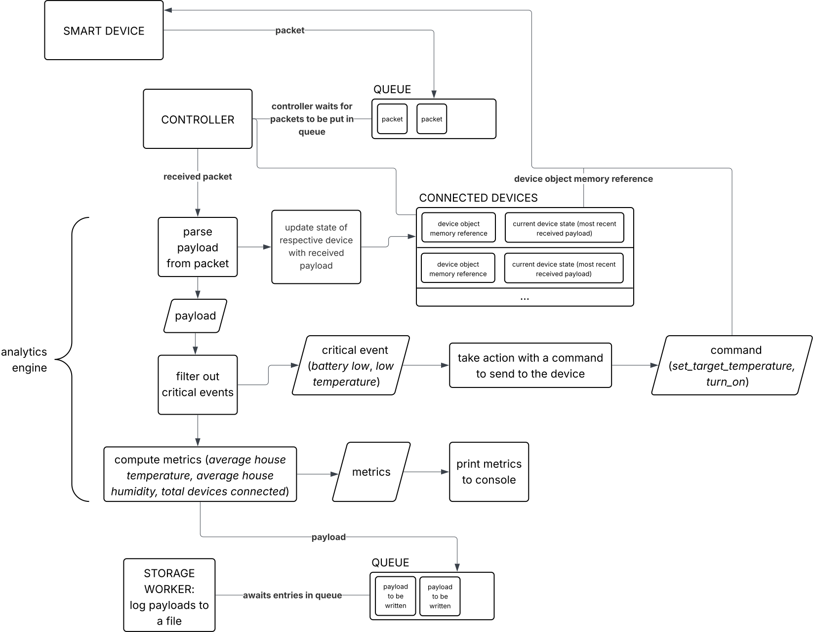

# EcoHub

A simulation of an internet of things (IoT) system with smart devices and a central controller communicating with them as their state changes.

This project aims to incorporate concepts from OOP Python, concurrent programming with the `asyncio` module as well as with threads, and functional programming concepts.

## How it works

- Smart devices (smart bulbs, smart thermostats, smart cameras) connect to a controller and, as their state changes over time (temperature changes, motion detection, humidity changes), they send updates to the controller in the form of packets containing payloads.
- The controller receives incoming packets via a `asyncio.Queue`. The controller is on standby until it receives a packet, without blocking the devices from sending packets. Each packet from a device is processed *sequentially* by the controller.
- Using a module called **analytics engine**, packets are turned into payloads that the controller stores for each device connected and updates the device state accordingly. For example, when a smart thermostat connects to the controller, it sends a payload. The controller receives the payloads and stores a reference of the object representing the thermostat device, and stores the received parsed payload. When the device sends a packet again, this stored payload is updated.
- The analytics engine then filters out received payloads to determine critical events, i.e. if any action needs to be taken by the controller. For example, if a smart camera detects motion, the analytics engine will flag this event as critical and the controller will take action by sending a command to the camera to take a snapshot. Critical events are then sent to the devices through a method on the device object. When the device executes the command, it prints a corresponding message to the console.
- The analytics engine also computes metrics for every received payload: *average house temperature*, *average humidity level*, *total number of devices connected*. These metrics are printed to the console.
- For every received parsed payload, the controller calls a **storage worker**, running in a separate thread, to log the payload to a file.
- The storage worker has a queue (`queue.Queue`) that the controller puts payloads into for logging. The storage worker thread blocks on this queue until a payload is available to log, then logs the payload to a file (*every payload is logged sequentially*), flushing the file (saving the file and writing to disk) after every write.
- When the program is terminated (via `CTRL+C`), the controller inserts a `None` value into the storage worker's queue, signalling it to terminate.

## Diagram

Below is a high-level diagram of the EcoHub system architecture. Note that the notation used does not conform to any standard (e.g. UML) and is for illustrative purposes only 😅.

## Concepts learned

See the [wiki](https://github.com/raulariton/ecohub/wiki/Wiki) page for explanations of concepts learned and architectural choices made.
